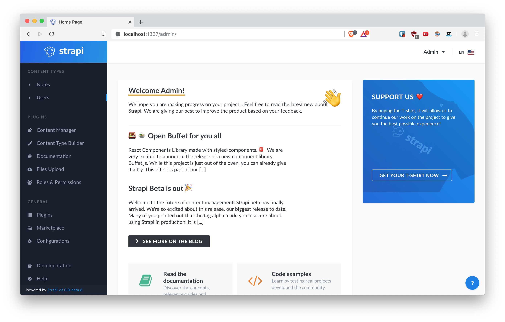

# gonotes-cms



Quickstart

```bash
npm install strapi@alpha -g
# cloning with ssh 
git clone git@github.com:daehruoydeef/gonotes-cms.git
cd gonotes-cms
strapi develop
```


visit localhost:1337/admin